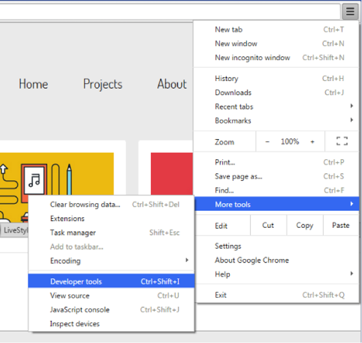
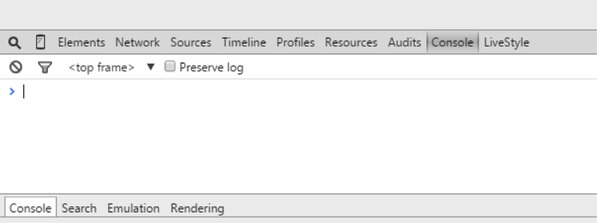
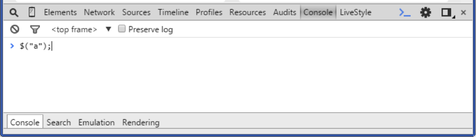
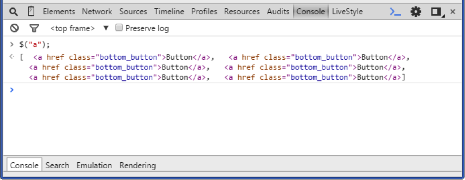

# Challenge: Elements Selection

### Using Chrome Development Tools

jQuery is usually written in a separate file to the HTML and then linked, like an external CSS file. However you can also use Chrome dev tools to write jQuery statements right in the browser. Give this a try yourself:

- Let begin by opening Sample Site in the lesson folder
- Take 6 minutes to familiarise yourself with the code
- Open up Chrome and development tools as shown below:

- Click console on the Developer tools menu, as shown below:

- Now we can type jQuery statements directly into the browser and hit Enter to see the result. For example, return all link (<a>) elements:

- jQuery returns all the <a> tags on the page, similar to what is shown below:

### Elements Selection

Let's use this technique to select the following:

- All images - **element**
- card_image - **class**
- footer - **id**
- All paragraph tags  within the footer 
- All header elements 
- The first element on the page
- The last div on the page
- The last image on the page
- All elements with an alt attribute
- The last div on the page
- The last image on the page
- All elements with an **alt** attribute

