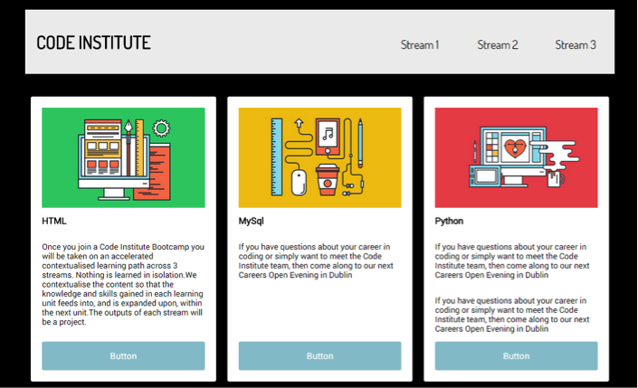

# Challenge: Events

Using the card panel example we worked on last lesson

1.  Inside your _script.js_  file add a **click event** which will trigger when a `
` tag is clicked and will change the color of all `
` tags to red. You can use the .css() function at first. 
2.  When a `<h2>` is hovered over, the background of all `<h2>`s are  changed to the colour lightblue.
3.  When a `<h2>` is hovered over its font size increases, but only for that particular `<h2>` (hint:  add an id to the `<h2>` )
4.  When a button is hovered the background color of the page turns black.
5.  When a button is no longer hovered the background color of the page turns grey.
 

