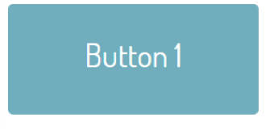

# Challenge: Button

Change all the `<a>` tags to  `<button>` elements. Don’t forget the closing tag and remove the href attribute. . Make the _first button_ hide when clicked. (hint: use an id on the button )
 

On same  button.

Try the , _slow_, _medium_ and _fast_ and a number in milliseconds. (you will need to refresh to get the button back).
