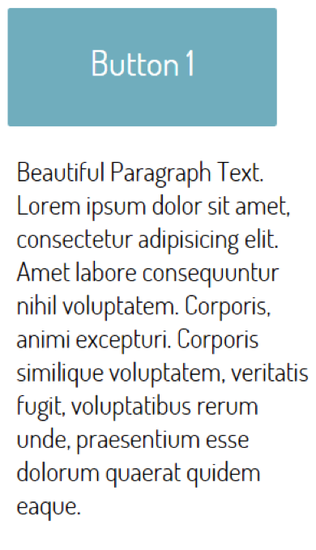
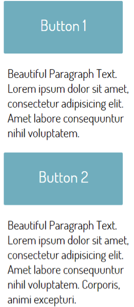

# Challenge: Sample Site

## Part A

Download Sample-Site.zip from the lesson folder. Unzip and bring up the folder in sublime. Make changes to the _script.js_ file for the jQuery code.

Apply the following behaviour to the blue button in the button.html file:

- Create a CSS class (_makeRed_, add it to style.css) which gives the Button a Red color, apply this class to the button Element (add to class attribute in the html).
- Create another class (_makeBorder_, add it to style.css) which gives the Button a border of 2px,  do not apply to the HTML.
- On _mouseenter_ remove the _red class_ and add the _border class_
- On _mouseleave_ reverse the above.
- Use method chaining to achieve the above
 

## Part B

- When the button is clicked make the paragraph slide up. When clicked again, make it slide down.

This is a real world example of how jQuery can be used, on a button or on a menu item.

## Part C

1.  Now try _hide() /show()_ and _fadeIn()/fadeOut() _on button click.
2.  Continuing:

- Create a second button and paragraph 
- Run the code and click on the buttons.
 

 
