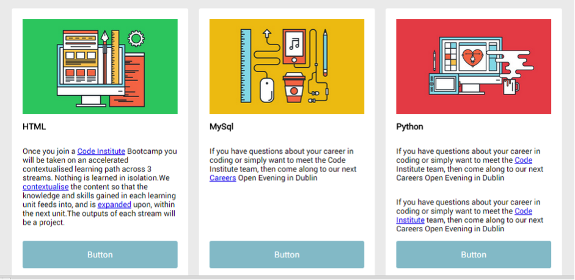
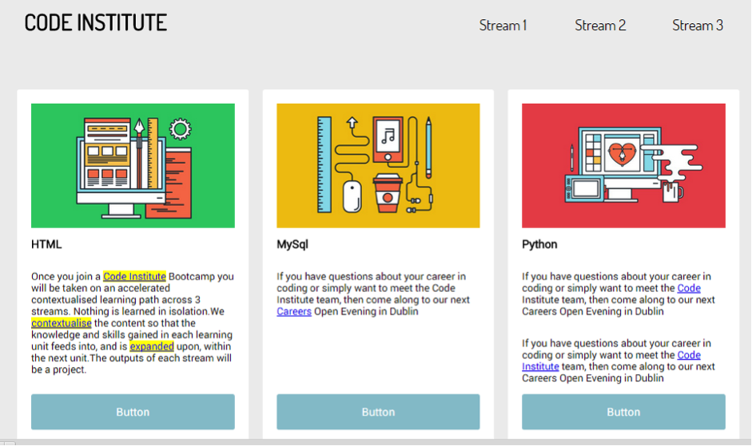

# Challenge: Site Practice 2

Continuing from the last Challenge on the previous lesson:
Add a number of links within the card paragraphs. That don’t need to go anywhere (href="#").

Add a script that performs the following:
- When a paragraph is clicked all links within are highlighted in yellow.

