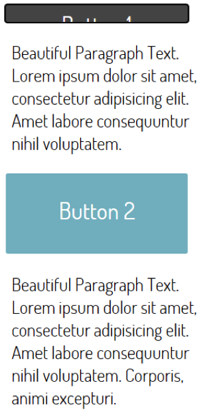
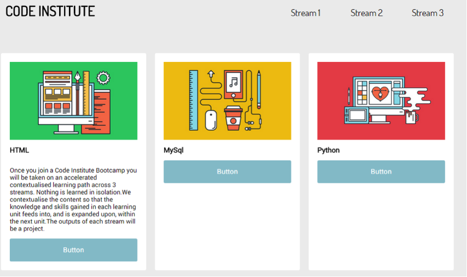
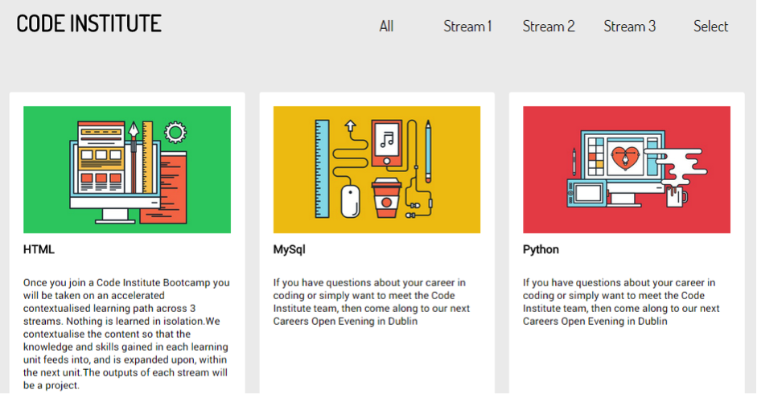
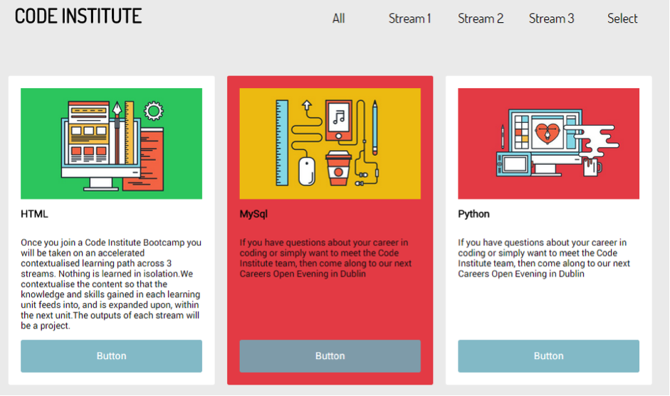
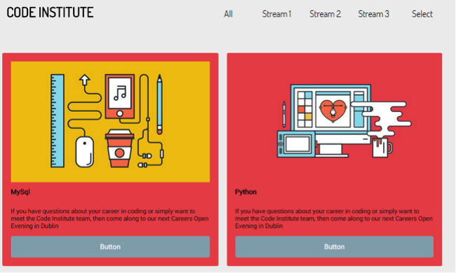

# Challenge: Site Practice

Now with this knowledge of traversing the DOM we can continue the issue with this from the previous lesson.  Have a look back at where we left off.

In the last lesson when we click the button we want the paragraph below to slide up and down (as we toggle). Right now the button itself is sliding up and down. this is working but on the wrong element.  

```javascript
$('div').click(function(){
      $('p').slideToggle('slow');    
  });
```

```javascript
$('div').click(function(){
      $(this).slideToggle('slow');    
  });
```
 


Here is where our knowledge of traversing comes into play. What is the relationship or connection (DOM wise) between the div Button and the paragraph that follows it?

### Part B: Return to the cards page.

1.  Give the paragraphs inside the cards a display:none
2.  Use slideDown to display the card paragraphs when the card_image is clicked.



### Part C

- When a card is clicked on the background color is highlighted e.g. set background-color to pink via adding a new class.
- When the card is clicked again it is unhighlighted. (see toggleClass)

### Part D

Add two more nav elements to the nav bar, select and all



- When select is clicked all panels disappear except those selected. This is a difficult challenge. Think about what is different about the highlighted panels. How could we select only those without the highlighting (hint: they don’t have the new class). You may want to use the :not() selector (see lesson 18 at the end of the lesson).
 




- Clicking on All makes all panels reappear
 


There is a lot going on here, this combining of functions and selections is what makes jQuery it so powerful. Take your time here to understand what's happening before moving onto the next section.
