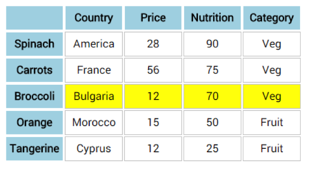
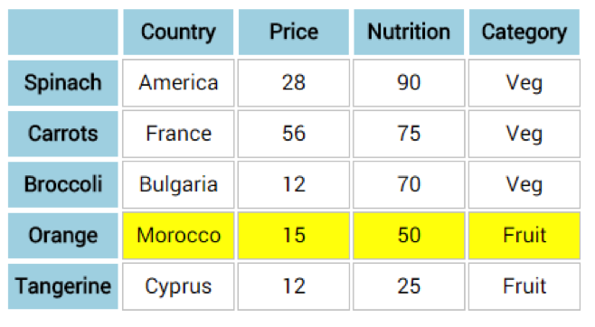

# Challenge: Color Blocks

Let’s practice some of the traversing methods:
Download Panel.zip from the lesson folder and extract locally. Open the folder in sublime. Bring up button.html in a browser.
 

Write jQuery code to perform the following (add to style.js):
- When a coloured panel is clicked all panels vanish. 
- When a coloured panel is clicked just that panel vanishes. 
- When a panel is clicked all siblings fade to 10% opacity.
- When reset is clicked all panels revert to full opacity.
- When the mouse hovers over a panel it that panel turns black (new CSS  class would be helpful here ).
- When the mouse moves away the panel reverts back to its previous colour.

### Part B

Return to the table challenge
- Then a table header (on the row)  is clicked the corresponding row should highlight
 

### More difficult

- When another table header(on the row)  is clicked the corresponding row should highlight and all others should turn white
- Add extra rows if you need to
- Traverse the DOM to find a solution

 

